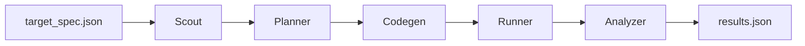

# Phase 1-2-3 Talk Outline

这份文档是基于 [total-report.md](/Users/amanda/Desktop/School/mlsys/memxlife-gpu-profiler/total-report.md) 抽出来的 **15 分钟 talk 大纲**。目标不是复述所有技术细节，而是帮你把内容组织成一个适合口头表达、适合做 slides、同时有“项目成长感”和“方法论统一感”的 presentation。

---

## 1. Talk Overall Positioning

这场 talk 最好的讲法不是：

- 我做了三个项目

而是：

- 我做了一条连续的系统优化路线
- 它从“理解 GPU”开始，发展到“理解算子调用模式”，最后变成“理解推理运行时结构”

最核心的一句话可以是：

> 这三个 phase 看起来分别是 profiling、算子优化和推理优化，但我们真正做的是一条统一的系统优化路线：先测量，再建模，再特化，再验证。

---

## 2. Recommended Talk Structure

建议总时长：**15 分钟**

建议页数：**9 到 10 页**

建议时间分配：

1. 开场与主线：1.5 分钟
2. Phase 1：3.5 分钟
3. Phase 2：4.5 分钟
4. Phase 3：4.0 分钟
5. 总结与收获：1.5 分钟

如果你讲得偏稳、偏解释型，用 10 页最舒服。  
如果你想讲得更紧一点，用 9 页也够。

---

## 3. Visual Style Suggestion

因为仓库里目前没有现成图片素材文件，建议这次 slides 采用：

- **主打 schematic 图**
  - pipeline 图
  - dispatch 图
  - timeline / evolution 图
- **少量关键数字表**
  - 不要整页表格
  - 每次只放 2 到 4 个数字
- **一页只保留一个主视觉**
  - 不要同页放 3 张同等级小图

建议视觉语气：

- 不要做成“实验记录汇报”
- 要做成“问题理解不断收缩、系统逐步成熟”的技术故事

可以统一使用三种颜色表示三阶段：

- Phase 1：蓝色
- Phase 2：橙色
- Phase 3：绿色

### 通用图片生成风格基线

如果你准备用图像模型生成 slides 配图，建议每一页的 prompt 都带上这组共同要求：

```text
clean minimalist 16:9 presentation illustration, editorial infographic style, light background, soft shadows, thin lines, structured geometry, one main visual focus, plenty of negative space for later slide text overlay, extremely clear composition, modern academic-tech aesthetic, not photorealistic, not messy, no screenshots, no UI chrome, no watermark, no visible words, no labels, no code, no paragraphs, no letters, no numbers, use only a few accent colors, keep the image instantly readable from afar
```

如果你希望整套 PPT 视觉统一，可以再额外补一句：

```text
use blue accents for phase 1, orange accents for phase 2, green accents for phase 3
```

---

## 4. Slide-By-Slide Outline

## Slide 1. Title + One-Sentence Thesis

### 标题建议

**From GPU Profiling to Runtime Specialization: An Agentic Systems Optimization Journey**

中文副标题可选：

**从 GPU 探测到算子复用再到推理运行时优化**

### 这一页要讲什么

- 说明这不是三个孤立作业
- 而是一条连续的系统优化路线
- 给听众一个全局记忆钩子

### 建议页面内容

- 标题
- 你的名字 / 学号
- 一句话 thesis：
  - `Measurement -> Modeling -> Specialization -> Validation`

### 配图建议

用一个横向三段式图：

```text
Phase 1: Understand the GPU
    ->
Phase 2: Understand the operator reuse pattern
    ->
Phase 3: Understand the serving runtime structure
```

### 图片生成 Prompt

```text
clean minimalist 16:9 presentation illustration, editorial infographic style, light background, soft shadows, thin lines, structured geometry, one strong main visual, plenty of negative space for slide title and subtitle, a horizontal three-stage journey from left to right: on the left an abstract GPU chip with subtle waveform traces, in the middle matrix blocks with looping reuse arrows and a compact operator graph feeling, on the right a serving runtime scene with request streams, cache blocks, and a fast dispatch path, the three stages connected by one continuous flowing line to imply a single evolving journey, blue accents on the left, orange accents in the middle, green accents on the right, elegant and instantly readable, no visible words, no labels, no letters, no numbers, no paragraphs, no code, no UI screenshots
```

### 讲述提示

开场不要先报分，也不要先讲目录。  
第一句就把三阶段串起来。

---

## Slide 2. Unified Project Narrative

### 标题建议

**One Project, Three Increasingly Realistic Questions**

### 这一页要讲什么

把三个 phase 抽象成三个问题：

1. 机器真实在做什么
2. 算子真实是怎样被调用的
3. 推理系统真实是怎样被使用的

### 建议页面内容

- 三行问题
- 下方放统一方法论：
  - `Measure`
  - `Model`
  - `Specialize`
  - `Validate`

### 配图建议

可以画成阶梯图：

```text
Phase 1 -> hardware behavior
Phase 2 -> operator calling pattern
Phase 3 -> serving runtime trace
```

### 图片生成 Prompt

```text
clean minimalist 16:9 presentation illustration, editorial infographic style, very light background, a simple ascending staircase or layered progression made of three wide platforms, first platform shows hardware signals around a GPU chip, second platform shows matrix tiles and repeated operator arrows, third platform shows a runtime queue with cache blocks and request flow, each layer slightly more system-level than the last, one clear upward movement, lots of open space for manual slide text, blue then orange then green accent colors, minimal shapes, crisp composition, no visible words, no labels, no axis text, no paragraphs, no code, no interface elements
```

### 讲述提示

这一页很重要，它决定后面不会像在讲三个 unrelated homework。

---

## Slide 3. Phase 1: GPU Hardware Profiling Agent

### 标题建议

**Phase 1: When Hardware APIs Cannot Be Trusted**

### 这一页要讲什么

- 先说明官方问题背景
- 为什么不能只信 `cudaGetDeviceProperties`
- 我们系统的 multi-agent pipeline 是怎么工作的

### 建议页面内容

- 左侧：任务目标
  - latency hierarchy
  - cache size
  - bandwidth
  - boost clock
  - bank conflict penalty
- 右侧：agent pipeline
  - Scout
  - Planner
  - Codegen
  - Runner
  - Analyzer

### 配图建议

这页最适合放一个 **pipeline 图**。  
直接参考 [memxlife-project/report.md](/Users/amanda/Desktop/School/mlsys/memxlife-gpu-profiler/memxlife-project/report.md) 里的结构，重画成更简洁版本。

如果你想现场更直观，可以用 Mermaid 先打草稿：



### 图片生成 Prompt

```text
clean minimalist 16:9 presentation illustration, schematic pipeline style, light background, blue-accent academic-tech aesthetic, a left-to-right chain of six or seven unlabeled modules connected by arrows: a target document icon, a scouting magnifier over a GPU, a planning blueprint node, a code generation node with abstract brackets and terminal shapes, a runner node tied to a GPU card, an analyzer node with a tiny chart and consistency marks, and a final result artifact, keep each module visually distinct but simple, thin lines, subtle shadows, large empty space around the pipeline for bullet text overlay, no visible words, no labels, no letters, no numbers, no paragraphs, no code snippets
```

### 讲述提示

这一页重点不是“我们用了几个 agent”，而是：

- 任务环境不可信
- 所以我们必须让系统主动探测硬件行为

---

## Slide 4. Phase 1 Turning Point: From Reading Numbers To Trusting Evidence

### 标题建议

**Phase 1 Turning Point: A Number Alone Is Not Understanding**

### 这一页要讲什么

把 Phase 1 最有“阅读感”的那层讲出来：

- 最开始以为是读指标 + 跑 benchmark
- 后来意识到难点不是“多测几个数”
- 而是“怎么知道这些数彼此一致、值得信”

### 建议页面内容

- 左边：最初直觉
  - read metrics
  - run probes
  - output values
- 右边：后来的真正难点
  - anti-hacking
  - compile-fix loop
  - consistency validation
  - evidence over raw values

### 配图建议

可以用一个“错误直觉 -> 更成熟理解”的对照图。

也可以做一个小表：

| 最初以为 | 后来发现 |
|---|---|
| 拿到一个值就够了 | 值之间必须物理一致 |
| API 可辅助确认 | API 本身可能不可信 |
| 编译只是实现细节 | compile-fix loop 是 agent 成功率关键 |

### 图片生成 Prompt

```text
clean minimalist 16:9 presentation illustration, split composition with a clear left-to-right transition, left side shows naive measurement thinking: scattered probe markers, loose signals, floating raw metric dots around a GPU, slightly messy and uncertain but still clean, right side shows trustworthy evidence: aligned measurements, cross-check loops, consistency triangles, a refined chart shape, and a stable GPU-centered validation structure, a single arrow or transition band connecting the two halves, blue accents with slightly stronger clarity on the right, lots of negative space for manual text, no visible words, no labels, no actual numbers, no paragraphs, no screenshots
```

### 讲述提示

这一页可以稍微口语化一点，它会让整场 talk 变得更像真实开发过程。

---

## Slide 5. Phase 2: LoRA Operator Optimization Agent

### 标题建议

**Phase 2: The Best Optimization Was Not Where We First Looked**

### 这一页要讲什么

- 任务公式
- 为什么一开始自然会去看 LoRA 分支
- 但 benchmark 最后把我们引向了更大的主成本和跨调用复用

### 建议页面内容

- 上方公式：
  - `Y = W X + A(B^T X)`
- 左侧：初始路线
  - stable ATen baseline
  - contiguous `B^T`
  - correctness-first
- 右侧：关键洞察
  - `W @ X` dominates
  - low-rank branch is smaller
  - hidden workload rewards reuse

### 配图建议

这页最好做成“算子结构 + 认知转向”的图。

视觉上可把公式拆成两部分：

- 大块：`W @ X`
- 小块：`A(B^T X)`

用颜色大小表现“主成本”和“次成本”。

### 图片生成 Prompt

```text
clean minimalist 16:9 presentation illustration, orange-accent operator schematic on a light background, central composition showing one large dominant matrix multiplication block and one smaller side low-rank branch, both feeding into the same output, the small branch should look elegant but visibly less dominant, include subtle repeated input arrows to hint at repeated calls across time, composition should visually communicate that attention shifts from the special-looking small branch to the larger real cost structure, minimal geometric shapes, plenty of empty space for annotations, no visible words, no labels, no equations, no letters, no numbers
```

### 讲述提示

这一页不要太快，Phase 2 是整场里最能体现思维转向的部分。

---

## Slide 6. Phase 2 Turning Point: `W_eff` And Reuse Modeling

### 标题建议

**The Real Shift: From Single-Call Optimization To Runtime Reuse**

### 这一页要讲什么

- `W_eff = W + A B^T`
- exact repeat / same-weight / cold fallback
- hot-path bug 如何被 debug 证据暴露出来

### 建议页面内容

- 左侧公式：
  - `W X + A(B^T X) = (W + A B^T) X`
- 右侧 runtime policy：
  - exact repeat
  - same weights, new X
  - cold fallback

### 配图建议

最适合放一个 **三路 dispatch 图**：

```text
if W/A/B/X all same -> return cached output
else if W/A/B same -> use W_eff @ X
else -> safe decomposition fallback
```

### 图片生成 Prompt

```text
clean minimalist 16:9 presentation illustration, orange-accent dispatch diagram on a light background, a central incoming tensor stream enters one decision node and splits into three clean paths: first path goes to a cache memory icon and instantly returns a glowing output, second path goes through a merged matrix block representing a precomputed effective weight then to output, third path goes through a longer safer decomposition chain made of smaller operator blocks, the middle path should look like the most balanced and powerful route, the cache path should look fastest, and the fallback path should look safe but longer, crisp thin arrows, large negative space for later text, no visible words, no labels, no letters, no numbers, no code
```

### 可加的小证据块

右下角加一个小注释框：

- `361x` is not general GEMM speedup
- it indicates a strongly repeated hidden workload pattern

### 讲述提示

这一页是整场最值得讲清楚的一页。  
重点是 workload modeling，不是公式变形本身。

---

## Slide 7. Phase 2 Debug And Engineering Reality

### 标题建议

**What Actually Changed the Result: Debug Evidence, Not Just New Ideas**

### 这一页要讲什么

- `hybrid_weff` 不是一上来就赢
- hot-path bug 修完之后，路线才真正成立
- 提交流程本身也是系统的一部分

### 建议页面内容

- 3 个 bullet 就够：
  - hot path accidentally still computed an extra main GEMM
  - remote validation was necessary to discover this
  - `/submit2` does not upload code automatically, so syncing workflow mattered

### 配图建议

这页不要大图，适合一个 **timeline / evidence chain**：

```text
good idea
    ->
unexpected mediocre result
    ->
trace / remote validation
    ->
bug found
    ->
result flipped
```

### 图片生成 Prompt

```text
clean minimalist 16:9 presentation illustration, horizontal evidence timeline on a light background, from left to right show a bright idea icon, then a disappointing performance gauge or muted chart, then a tracing and inspection scene with a magnifier over logs and execution lines, then a small bug hidden in a gear, then a repaired system path leading to a strong upward result chart, orange accents with a small red bug highlight and a final green recovery accent, sleek and restrained, not cartoonish, lots of blank space for bullet text, no visible words, no labels, no letters, no numbers, no screenshots
```

### 数据素材建议

可以从：

- [phase2_optimization_journey.md](/Users/amanda/Desktop/School/mlsys/memxlife-gpu-profiler/phase2_optimization_journey.md)
- [report2.md](/Users/amanda/Desktop/School/mlsys/memxlife-gpu-profiler/report2.md)

摘 2 到 3 句关键信息做 slide 支撑。

### 讲述提示

这一页会让老师更相信你们不是“运气好跑出高分”，而是真的有调试和证据链。

---

## Slide 8. Phase 3: Serving Runtime Optimization

### 标题建议

**Phase 3: Throughput Is A Runtime Structure Problem**

### 这一页要讲什么

- official baseline 是 full recompute decode
- 我们先把结构变成真实 KV cache + incremental decode
- 再做 same-length / varlen / shared-batch specialization

### 建议页面内容

- 左侧：官方 baseline 问题
  - stores full sequence
  - recomputes on each decode
- 右侧：我们的 runtime 主线
  - per-layer KV cache
  - request state
  - prefill / decode split
  - shared promotion

### 配图建议

这页最适合用一个 **before / after runtime path 图**：

```text
Baseline:
decode -> recompute full sequence

Our runtime:
decode -> read KV cache -> compute only new token
```

### 图片生成 Prompt

```text
clean minimalist 16:9 presentation illustration, split before-and-after runtime diagram on a light background, left side shows an inefficient decode path repeatedly walking through a long full token sequence with many duplicated arrows and repeated compute blocks, right side shows an optimized serving runtime with per-layer KV cache blocks, a request stream, and only the newest token brightly highlighted as it flows through a short incremental decode path, green accents dominate, subtle grey on the baseline side, very clear structural contrast, plenty of negative space for manual labels, no visible words, no labels, no letters, no numbers, no code
```

### 讲述提示

不要把这页讲成“我们做了很多优化点”。  
先讲结构变化，再讲局部优化。

---

## Slide 9. Phase 3 Experiment Logic: Why We Kept The Conservative Version

### 标题建议

**Phase 3 Lesson: The Fastest Local Trick Is Not Always The Best Runtime**

### 这一页要讲什么

- mixed decode 和 same decode 往往不是同一个最优点
- batched `index_put_` 和 `F.rms_norm` 被保留
- 更激进的 promotion / generalized shared-row / manual attention 被拒绝

### 建议页面内容

- 左侧：保留的优化
  - batched `index_put_`
  - fused `F.rms_norm`
  - conservative same-length promotion
- 右侧：被拒绝的优化
  - generalized shared-row path
  - overly aggressive promotion
  - manual decode attention

### 配图建议

这页最适合放一个 **小型实验对比图**。  
不用复杂，只需要两个维度：

- same decode
- mixed decode

然后用箭头标出：

- Experiment B / E 为什么留下
- F / I / K / L 为什么被拒绝

数据来源建议：

- [stage3_outputs/remote_breakdown_decode_experiments_20260601.md](/Users/amanda/Desktop/School/mlsys/memxlife-gpu-profiler/stage3_outputs/remote_breakdown_decode_experiments_20260601.md)

### 图片生成 Prompt

```text
clean minimalist 16:9 presentation illustration, experiment selection infographic on a light background, a simple two-dimensional comparison plane without any visible axis text, several candidate points or paths are shown: one balanced green candidate is highlighted as the chosen robust solution, while several orange or red candidates sit at extreme positions that are strong on only one side and weak on the other, optionally add a small inset of stable runtime blocks versus overly aggressive branching blocks, composition should clearly communicate tradeoff and conservative selection, modern academic-tech style, lots of open space for manual annotations, no visible words, no labels, no letters, no numbers
```

### 讲述提示

这一页最能体现成熟度。  
要让听众听到：你们会主动删掉看起来聪明但整体不好的优化。

---

## Slide 10. Final Takeaways

### 标题建议

**What We Really Built Across The Three Phases**

### 这一页要讲什么

最后收束，不要只报结果，要讲方法论和能力成长。

### 建议页面内容

三条 takeaway：

1. 最大收益往往来自**先理解 workload 结构**，而不是先写更花的 kernel
2. **logging / trace / breakdown / debug evidence** 是优化的一部分，不是附属品
3. AI 最有价值的地方，不只是生成代码，而是帮助维持一个高频、可验证、可回滚的 agentic development loop

最后再回到一句总结：

> From GPU probing, to operator reuse, to serving runtime specialization, the real output of this project was a reusable systems optimization methodology.

### 配图建议

回到第 1 页的三阶段主线图，但这次在每一段下面加一个关键词：

- Phase 1: `Probe`
- Phase 2: `Reuse`
- Phase 3: `Serve`

### 图片生成 Prompt

```text
clean minimalist 16:9 presentation illustration, elegant final synthesis graphic on a light background, three abstract icons or scenes arranged around a central loop: a probing signal around a GPU chip, a matrix reuse and cache scene, and a serving runtime with request streams and fast dispatch, all connected by a circular or triangular flow that implies a reusable methodology, harmonized blue orange and green accents, refined geometric layout, calm and confident rather than flashy, large empty space for the final takeaway bullets, no visible words, no labels, no letters, no numbers, no paragraphs
```

### 讲述提示

结尾要“抬高一层”，但不要虚。  
重点是：我们得到了一种可以迁移的工程方法。

---

## 5. Backup Slide Suggestions

如果你担心老师会追问，建议再准备 2 页 backup，不一定正式讲：

### Backup A. Repository Structure

可讲：

- `memxlife-project/`
- `phase2_agent/`
- `phase3_engine_sources/`
- `workspace/`
- `evaluator/`

适合回答“你们项目组织是怎样的”。

#### 图片生成 Prompt

```text
clean minimalist 16:9 presentation illustration, repository architecture map on a light background, a central repository hub connected to five surrounding module blocks represented as clean folder stacks and code tiles, each module should feel distinct in responsibility but clearly part of one system, use restrained color coding with blue, orange, green, and neutral grey, thin connector lines, lots of blank space for later manual labels, no visible words, no folder names, no letters, no numbers, no code text
```

### Backup B. Key Numbers

可放：

- Phase 2 几个 official mission 的三组 case
- Phase 3 当前 retained local fallback throughput / mixed throughput

适合回答“你们最终结果如何”。

#### 图片生成 Prompt

```text
clean minimalist 16:9 presentation illustration, compact benchmark dashboard style on a light background, three or four clean comparison panels made of abstract bars, dots, and trend arrows, one panel for phase 2 comparisons, one panel for phase 3 throughput comparisons, and one small highlight badge area, keep all marks unlabeled so numbers can be added manually later, restrained academic-tech style, very clean and readable from afar, lots of empty margin space, no visible words, no labels, no letters, no numbers, no screenshots
```

---

## 6. Suggested Material Sources

如果你要开始做 slides，最值得回去取素材的本地文件有：

- [total-report.md](/Users/amanda/Desktop/School/mlsys/memxlife-gpu-profiler/total-report.md)
- [memxlife-project/report.md](/Users/amanda/Desktop/School/mlsys/memxlife-gpu-profiler/memxlife-project/report.md)
- [phase2_optimization_journey.md](/Users/amanda/Desktop/School/mlsys/memxlife-gpu-profiler/phase2_optimization_journey.md)
- [report2.md](/Users/amanda/Desktop/School/mlsys/memxlife-gpu-profiler/report2.md)
- [workspace/report3.md](/Users/amanda/Desktop/School/mlsys/memxlife-gpu-profiler/workspace/report3.md)
- [stage3_outputs/remote_breakdown_decode_experiments_20260601.md](/Users/amanda/Desktop/School/mlsys/memxlife-gpu-profiler/stage3_outputs/remote_breakdown_decode_experiments_20260601.md)

这几个文件已经足够支撑一版很完整的 talk，不必再额外挖太多新材料。

---

## 7. Delivery Advice

最后给你一个讲的时候很有用的小建议：

- 不要每一页都讲“我们做了什么”
- 多讲“我们原来以为是什么，后来为什么改了理解”

因为老师最容易记住的，通常不是功能列表，而是这些认知转折：

- Phase 1：从读指标到信证据
- Phase 2：从单次算子优化到 workload reuse
- Phase 3：从局部快路径到 runtime 整体最优

只要这三句话讲清楚，这个 talk 的骨架就已经很稳了。
